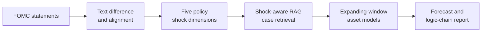
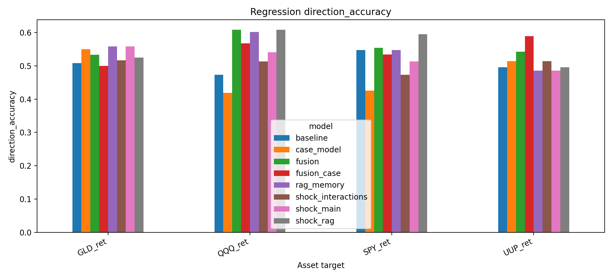
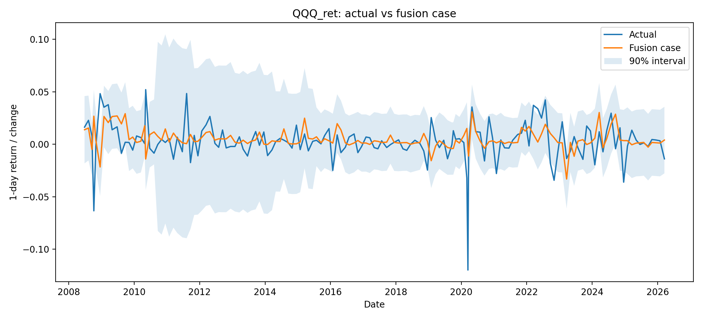
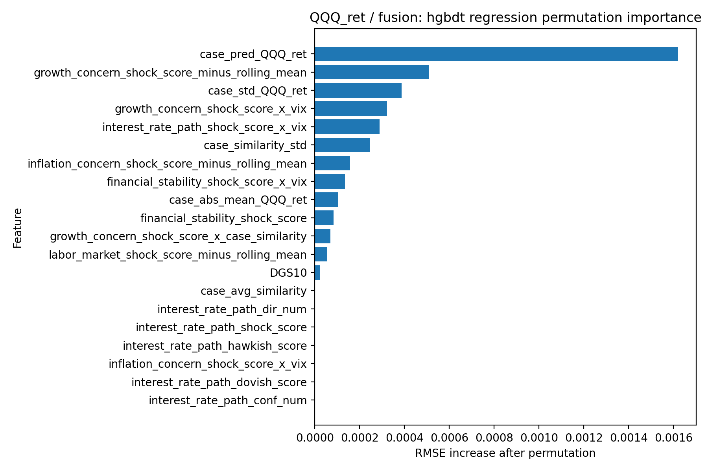

<div align="center">

# FOMC RAG Predicting

### From policy language to auditable multi-asset forecasts

An NLP and retrieval-augmented forecasting pipeline that converts FOMC statement changes into structured policy shocks, retrieves comparable historical meetings, and predicts one-day reactions across SPY, QQQ, GLD, and UUP.

[](https://www.python.org/)
[](#01--statement-to-signal)
[](#02--historical-case-memory)
[](#03--multi-asset-modeling)


</div>

## At a glance

| Research layer | What it does | Main artifact |
|---|---|---|
| **Statement intelligence** | Aligns consecutive statements and extracts five policy-shock dimensions | Auditable direction, strength, confidence, and evidence |
| **Historical case memory** | Retrieves FOMC events with similar language, shocks, and macro states | Similarity-weighted market memory |
| **Multi-asset forecasting** | Tests linear and nonlinear models on SPY, QQQ, GLD, and UUP | Direction, return magnitude, and 90% intervals |
| **Research interface** | Connects model output with policy evidence and historical analogues | Browser-based logic-chain report |

This repository presents a complete **text analysis and large-language-model course project**. The focus is the end-to-end research pipeline: extracting interpretable policy signals, testing whether historical analogues add information, and communicating model uncertainty clearly.

## Research pipeline



---

## 01 · Statement to signal

Each current statement is compared with the preceding statement. Additions, deletions, and changes in emphasis are converted into five structured dimensions:

| Policy dimension | Signal captured |
|---|---|
| Interest-rate path | Hold, tightening, easing, and forward-guidance changes |
| Inflation concern | Persistence, progress, and price-stability emphasis |
| Growth concern | Activity, demand, outlook, and downside-risk language |
| Labor market | Employment, job gains, unemployment, and labor tightness |
| Financial stability | Credit conditions, banking stress, liquidity, and market functioning |

For every dimension, the pipeline records a **hawkish / dovish / neutral** direction, strength score, confidence level, and supporting sentence. This keeps the text signal inspectable rather than treating the LLM as a black box.

## 02 · Historical case memory

The retrieval layer represents each meeting through four complementary views:

- structured policy-shock similarity;
- semantic similarity of shock evidence;
- full-statement semantic similarity;
- distance in the prevailing macro-market state.

The top historical meetings are converted into numeric case-memory features—including similarity-weighted returns, upside probability, dispersion, and direction agreement—before entering the forecasting model.

> RAG memory is **shock-aware**. It answers: “How did markets react after historically similar policy events?” It is not a causal estimate or a text-only lookup.

## 03 · Multi-asset modeling

The experiment uses expanding-window backtests: every prediction is generated using only information available before that FOMC event.

| Scope | Design |
|---|---|
| Assets | SPY · QQQ · GLD · UUP |
| Out-of-sample predictions | 523 |
| Model families | Ridge · Lasso · ElasticNet · HGBDT · XGBoost |
| Feature sets | Baseline · shocks · interactions · RAG memory · fusion |
| Metrics | Direction accuracy · balanced accuracy · MAE · RMSE · 90% coverage |

### Model comparison



The strongest direction-oriented specification is **HGBDT / fusion**, which combines macro states, policy shocks, shock interactions, and historical case memory.

| Headline result | Value |
|---|---:|
| Baseline mean direction accuracy | 52.18% |
| RAG-memory mean direction accuracy | **54.24%** |
| HGBDT/fusion direction accuracy | **55.94%** |
| HGBDT/fusion balanced direction accuracy | 54.21% |
| Lowest reported RMSE | **0.0137** — Lasso/fusion-case |
| Narrowest mean 90% interval | **0.0489** — Lasso/fusion-case |

The results reveal a useful trade-off: nonlinear fusion performs better on **direction**, while sparse linear models are more stable for **return magnitude**. No single model dominates every metric.

### Forecast behavior and uncertainty



The prediction intervals make uncertainty visible. Event returns remain noisy, and direction improvements do not imply precise point forecasts—particularly during high-volatility regimes.

## 04 · What drives the fusion model?



For the QQQ fusion specification, the similarity-weighted historical return is the most influential feature in the archived permutation test. Growth-concern shocks, return dispersion across retrieved cases, volatility interactions, and rate-path interactions also contribute. These are predictive dependencies, not causal effects.

## 05 · Interactive research report

The included browser interface brings the project components together:

- current and previous FOMC statements;
- extracted policy shocks and textual evidence;
- retrieved historical cases and similarity scores;
- multi-asset point forecasts and 90% intervals;
- model diagnostics and a generated logic-chain report.

```bash
python src/app/serve_frontend.py
```

Open `http://127.0.0.1:8000` after launching the server.

## Repository structure

```text
.
├── assets/                 # README visuals
├── data/
│   ├── raw/                # Source statement and market workbook
│   ├── interim/            # Event-level FOMC panel
│   ├── processed/          # Structured policy shocks
│   └── rag_corpus/         # Retrieval text, metadata, and embeddings
├── docs/                   # Experiment report and prompts
├── frontend/               # Interactive report application
├── outputs/                # Retrieval and modeling artifacts
├── src/
│   ├── rag/                # Extraction, alignment, and retrieval
│   ├── modeling/           # Features, backtests, and evaluation
│   └── app/                # Inference and report generation
└── requirements.txt
```

## Quick start

```bash
python -m venv .venv
source .venv/bin/activate       # Windows: .venv\Scripts\activate
pip install -r requirements.txt

python src/rag/extract_fomc_events.py
python src/rag/build_rag_corpus.py --skip-api
python src/rag/retrieve_fomc_neighbors.py
python src/modeling/modeling.py --model-family hgbdt
```

API-based shock extraction and embeddings require the environment variables documented in the source scripts. No credentials are included in this repository.

## Documentation

- [Full experiment report](docs/experiment_report.md)
- [Frontend guide](frontend/fomc_report_app/README.md)
- [Logic-chain report example](frontend/fomc_report_app/llm_logic_chain_report.md)

## Limitations

- FOMC event returns are noisy and the event sample is limited.
- Historical similarity does not imply causal repetition.
- LLM-extracted shocks depend on prompt and model behavior.
- Prediction-interval calibration varies across market regimes.
- Reported results are research outputs, not evidence of a deployable trading strategy.

---

<div align="center">
For educational and portfolio purposes only. Nothing in this repository constitutes investment advice.
</div>
