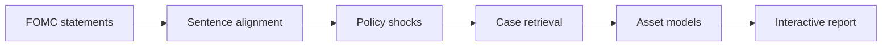

# FOMC RAG Predicting

An end-to-end NLP and large-language-model course project for predicting one-day market reactions to FOMC statements. The pipeline converts policy language into structured shocks, retrieves comparable historical meetings, combines case memory with macro-financial features, and forecasts returns for SPY, QQQ, GLD, and UUP.


## Pipeline



The system extracts five policy dimensions: interest-rate path, inflation concern, growth concern, labor market, and financial stability. Each event is linked to macro conditions, text embeddings, shock evidence, and realized post-meeting returns. Expanding-window backtests compare linear and nonlinear models across baseline, shock, interaction, RAG-memory, and fusion feature sets.

## Key results

| Finding | Result |
|---|---:|
| Baseline mean direction accuracy | 52.18% |
| RAG-memory mean direction accuracy | 54.24% |
| Best direction model | HGBDT / fusion |
| Best direction accuracy | 55.94% |
| Balanced direction accuracy | 54.21% |
| Lowest reported RMSE | 0.0137 (Lasso / fusion-case) |
| Narrowest mean 90% interval | 0.0489 (Lasso / fusion-case) |

Historical case memory provided the most consistent incremental direction signal. Nonlinear fusion was stronger for direction, while sparse linear models were more stable for return magnitude. No single model dominated every metric.

## Method

1. Transform the source workbook into an event-level FOMC panel.
2. Align consecutive statements and retain auditable sentence changes.
3. Use an OpenAI-compatible endpoint to extract shock direction, strength, confidence, and evidence.
4. Build API embeddings and local TF-IDF/SVD representations.
5. Retrieve shock-aware historical meetings under similar macro conditions.
6. Run expanding-window tests with Ridge, Lasso, ElasticNet, HistGradientBoosting, and XGBoost.
7. Evaluate direction, magnitude error, and 90% interval calibration.
8. Connect predictions, policy evidence, and cases in a browser report.

## Repository structure

```text
data/       Raw data, event panel, policy shocks, and retrieval corpus
docs/       Experiment report and LLM prompts
frontend/   Interactive FOMC report application
outputs/    Retrieval and modeling artifacts
src/        Extraction, retrieval, modeling, and application code
```

## Quick start

```bash
python -m venv .venv
source .venv/bin/activate       # Windows: .venv\Scripts\activate
pip install -r requirements.txt
```

```bash
python src/rag/extract_fomc_events.py
export SJTU_API_KEY="YOUR_API_KEY"
python src/rag/run_batch.py
export DASHSCOPE_API_KEY="YOUR_API_KEY"
python src/rag/build_rag_corpus.py
python src/rag/retrieve_fomc_neighbors.py
python src/modeling/modeling.py --model-family hgbdt
```

Use `python src/rag/build_rag_corpus.py --skip-api` for a local TF-IDF/SVD-only corpus.

Launch the report interface:

```bash
python src/app/serve_frontend.py
```

Then open `http://127.0.0.1:8000`.

## Documentation

- [Experiment report](docs/experiment_report.md)
- [Frontend guide](frontend/fomc_report_app/README.md)
- [Generated logic-chain example](frontend/fomc_report_app/llm_logic_chain_report.md)

## Scope and limitations

This is a text-analysis and large-language-model course project, not a production trading system. FOMC event returns are noisy, the event sample is limited, retrieved similarity is not causal identification, and interval calibration varies across regimes. Results do not constitute investment advice.
